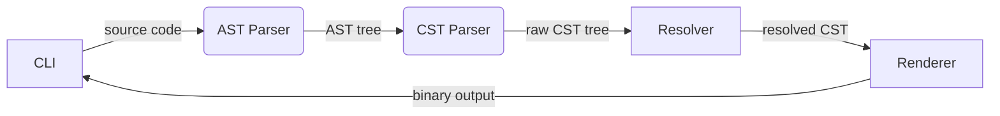

# Hexo compiler architecture

## Glossary

- Atom
    - Resolved - single byte value
    - Unresolved
        - Constant - reference to named constant
        - Function Invocation - function name with arguments (that are by themself atoms)

## Current state

Hexo compiler is split in multiple steps:

1. CLI utility
   : Responsible for user interaction, configuration, source loading and command dispatching.

2. AST parser
   : Pest base parser / lexer, build abstract syntax tree.
   Produced AST structure might be have correct syntax, but might be semantically incorrect.

3. CST parser
   : Builds high level representation. Build CST is guaranteed to be semantically correct.

4. Cst resolver
   : Performs transformation on CST, resolves all values, functions and variables.

5. Renderer
   : Transforms CST into final binary output.

## Future improvements

- Remove double CST states, probably should be split in resolved and unresolved trees
- Move function execution out of resolver
- Centralize atom resolution, currently it is all over the place
- Add support for constants and functions inside functions